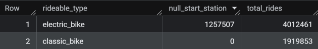
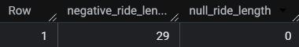
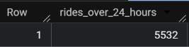
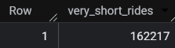
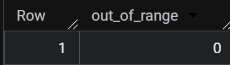

# Cyclistic Bike-Share Analysis: How Do Annual Members and Casual Riders Use Bikes Differently?

## Overview
This project analyzes historical bike-share trip data for Cyclistic, a fictional bike-share company operating in Chicago, as part of the Google Data Analytics Professional Certificate capstone. The goal is to understand behavioral differences between annual members and casual riders in order to support a marketing strategy aimed at converting casual riders into annual members.

## Business Task
Cyclistic's director of marketing believes the company's future growth depends on maximizing annual memberships, since annual members are more profitable than casual riders. Rather than targeting new customers broadly, the marketing team wants to convert existing casual riders into annual members.

This analysis specifically addresses the first of three guiding questions assigned to the marketing analytics team:

> **How do annual members and casual riders use Cyclistic bikes differently?**

## Data Source
This analysis uses Cyclistic's historical trip data, made publicly available by Motivate International Inc. (operators of the real-world Divvy bike-share system, on which this fictional case study is based).

- **Source:** [Divvy Trip Data](https://divvy-tripdata.s3.amazonaws.com/index.html)
- **License:** [Divvy Data License Agreement](https://divvybikes.com/data-license-agreement) — grants a non-exclusive, royalty-free, limited, perpetual license to access, analyze, and use the data for any lawful purpose.
- **Time period covered:** 12 months, July 2025 – June 2026
- **Format:** Monthly `.csv` files, one per month, imported as individual tables into Google BigQuery (dataset: `CyclisticData`, tables `2025-07-Trips` through `2026-06-Trips`)
- **Privacy note:** The dataset does not include personally identifiable rider information, so this analysis cannot connect ride data to individual riders (e.g., whether a casual rider has purchased multiple single-ride passes, or whether they live within the service area).

**Data credibility (ROCCC check):**
- **Reliable:** Sourced directly from the bike-share operator, not a third party
- **Original:** First-party trip-level data, not aggregated or altered by another source
- **Comprehensive:** Covers a full 12-month cycle, capturing seasonal variation
- **Current:** Reflects the most recent 12 months available at the time of analysis
- **Cited:** Publicly documented source and license, linked above

**Tools used:** Google BigQuery (SQL) for data storage, combination, cleaning, and analysis. Tableau for data visualizations.

## Process

### Tools Used
This phase was completed entirely in **Google BigQuery** using SQL, chosen for its ability to handle the full dataset without local file-size limitations and for direct compatibility with the SQL skills this project is meant to demonstrate.

### Correcting a Mislabeled File
While reviewing the twelve monthly files prior to combining them, one file intended to represent January 2026 trip data was found to be mislabeled as `202501-divvy-tripdata`. This was identified by opening the file and confirming that the dates in the spreadsheet fell in the year 2026. The file was renamed to `202601-divvy-tripdata`and its corresponding BigQuery table was renamed to `2026-01-Trips` to accurately reflect the data it contained.

### Combining the Twelve Monthly Tables
Each month of trip data (July 2025 – June 2026) was originally imported into BigQuery as its own table (`2025-07-Trips` through `2026-06-Trips`), all within the `CyclisticData` dataset. Since all twelve tables share an identical schema, they were combined into a single table using a wildcard query rather than twelve individual `UNION ALL` statements.

[View full script: `scripts/combine_tables.sql`](scripts/combine_tables.sql)

```sql
CREATE TABLE `CyclisticData.trips_combined` AS
SELECT *, _TABLE_SUFFIX AS source_table
FROM `CyclisticData.20*`
```

The `_TABLE_SUFFIX` column was included to preserve a record of which original table each row came from, making it possible to trace any row back to its source month if needed during later validation or cleaning.

### Validating the Combination
Next, the combination was verified by comparing the summed row count of all twelve original tables against the row count of the new combined table.

**Query used:**
```sql
-- Total row count of twelve original tables
SELECT SUM(row_count) AS total_source_rows
FROM `CyclisticData.__TABLES__`
WHERE table_id != 'trips_combined';

-- Total row count of combined table
SELECT COUNT(*) AS combined_row_count
FROM `CyclisticData.trips_combined`;
```

**Results:**

Sum of row counts across the twelve original tables:


Row count of the combined table:


The two totals matched, confirming that all rows from the twelve monthly tables were preserved in the combine with no data loss or duplication.

## Cleaning
[View full script: `scripts/cleaning.sql`](scripts/cleaning.sql)

### Checking for Duplicate Ride IDs
Since `ride_id` should uniquely identify each ride, the combined table was checked for any ride_id appearing more than once.

```sql
SELECT ride_id, COUNT(*) AS occurrences
FROM `CyclisticData.trips_combined`
GROUP BY ride_id
HAVING COUNT(*) > 1;
```

**Result:** 35 ride_ids were found with exactly 2 occurrences each (70 rows total).

### Investigating the Duplicated Rows
The full rows for each duplicated ride_id were pulled to determine whether they were genuine duplicates or distinct records sharing the same ID.

```sql
SELECT *
FROM `CyclisticData.trips_combined`
WHERE ride_id IN (
  SELECT ride_id
  FROM `CyclisticData.trips_combined`
  GROUP BY ride_id
  HAVING COUNT(*) > 1
)
ORDER BY ride_id;
```

**Result:** All 35 duplicated ride_ids were exact duplicate rows. Further analysis showed that each affected ride started on April 30, 2026 but ended after midnight on May 1, 2026. This led to the rides being captured in both the April and May monthly export files.

### Removing Duplicates
Since each ride actually started in April, the row tagged with the April source table was kept, and the corresponding May-tagged duplicate was removed.

```sql
DELETE FROM `CyclisticData.trips_combined`
WHERE source_table = '26-05-Trips'
  AND ride_id IN (
    SELECT ride_id
    FROM `CyclisticData.trips_combined`
    GROUP BY ride_id
    HAVING COUNT(*) > 1
  );
```

**Result:** 35 rows removed, leaving one instance of each affected ride, correctly attributed to its actual start month.

*(Note: the `source_table` column stores values as `YY-MM-Trips` rather than the full four-digit year)*

### Checking for Null Values
All columns were checked for missing values to identify any data completeness issues.

```sql
SELECT
  COUNTIF(ride_id IS NULL) AS null_ride_id,
  COUNTIF(rideable_type IS NULL) AS null_rideable_type,
  COUNTIF(started_at IS NULL) AS null_started_at,
  COUNTIF(ended_at IS NULL) AS null_ended_at,
  COUNTIF(start_station_name IS NULL) AS null_start_station_name,
  COUNTIF(start_station_id IS NULL) AS null_start_station_id,
  COUNTIF(end_station_name IS NULL) AS null_end_station_name,
  COUNTIF(end_station_id IS NULL) AS null_end_station_id,
  COUNTIF(start_lat IS NULL) AS null_start_lat,
  COUNTIF(start_lng IS NULL) AS null_start_lng,
  COUNTIF(end_lat IS NULL) AS null_end_lat,
  COUNTIF(end_lng IS NULL) AS null_end_lng,
  COUNTIF(member_casual IS NULL) AS null_member_casual,
  COUNTIF(source_table IS NULL) AS null_source_table
FROM `CyclisticData.trips_combined`;
```

**Result:** Nulls were found only in the following columns:

| Column | Null Count |
|---|---|
| `start_station_name` | 1,257,507 |
| `start_station_id` | 1,257,507 |
| `end_station_name` | 1,321,666 |
| `end_station_id` | 1,321,666 |
| `end_lat` | 5,600 |
| `end_lng` | 5,600 |

### Investigating Null Station Name/ID Values
To determine whether the missing `start_station_name`/`start_station_id` values represented a data quality issue or an expected pattern, the null rows were cross-referenced against `rideable_type`. 

```sql
SELECT
  rideable_type,
  COUNTIF(start_station_name IS NULL) AS null_start_station,
  COUNT(*) AS total_rides
FROM `CyclisticData.trips_combined`
GROUP BY rideable_type;
```
**Result:** 



All 1,257,507 rows with a null `start_station_name`/`start_station_id` were associated with `electric_bike` rides. Since electric bikes don't require a station to be locked up, it follows that having these values null is an expected pattern. As such, these values should be left in place and not removed.

### Adding `ride_length` and `day_of_week` Columns
In order to further investigate the null values, it was necessary to add columns that calculate ride length and what day of the week the ride started. With this information, it is possible to cross reference extremely long wait times with null `end_lat`/`end_lng` values to find rides that may not have ended. 

```sql
CREATE OR REPLACE TABLE `CyclisticData.trips_combined` AS
SELECT
  *,
  TIMESTAMP_DIFF(ended_at, started_at, MINUTE) AS ride_length,
  EXTRACT(DAYOFWEEK FROM started_at) AS day_of_week
FROM `CyclisticData.trips_combined`;
```

**`ride_length`:** Calculated using `TIMESTAMP_DIFF`, which returns the difference between `ended_at` and `started_at` in minutes. 

**`day_of_week`:** Calculated using `EXTRACT(DAYOFWEEK FROM started_at)`, which returns the values `1` for Sunday through `7` for Saturday


### Checking for Null or Negative Ride Lengths

```sql
CREATE OR REPLACE TABLE `CyclisticData.trips_combined` AS
SELECT
  *,
  TIMESTAMP_DIFF(ended_at, started_at, MINUTE) AS ride_length,
  EXTRACT(DAYOFWEEK FROM started_at) AS day_of_week
FROM `CyclisticData.trips_combined`;
```

**Result:** 




### Investigating Negative Ride Lengths

```sql
SELECT ride_id, started_at, ended_at, ride_length, rideable_type, member_casual
FROM `CyclisticData.trips_combined`
WHERE ride_length < 0
ORDER BY ride_length;
```

**Result:** All 29 rows with negative ride lengths occurred on 11/02/2025 between 1 and 2 am. This means that the negative ride lengths are attributed to the clock change for daylight savings.

Rather than deleting these rows, `ride_length` was corrected by adding 60 minutes to each affected ride to recover its true elapsed duration, since these represent legitimate rides with a fully explainable and recoverable duration rather than genuine data errors.

```sql
UPDATE `CyclisticData.trips_combined`
SET ride_length = ride_length + 60
WHERE ride_length < 0
  AND DATE(started_at) = '2025-11-02'
  AND EXTRACT(HOUR FROM started_at) = 1;
```

### Investigating Ride Lengths Exceeding 24 Hours

Divvy/Lyft's own published methodology typically treats rides over 24 hours (1,440 minutes) as bikes that weren't properly docked, rather than genuine rides. Therefore, the number of rides exceeding this ride length time were pulled.

```sql
SELECT COUNT(*) AS rides_over_24_hours
FROM `CyclisticData.trips_combined`
WHERE ride_length > 1440;
```

**Results:** 




### Removing Rides Over 24 Hours

```sql
DELETE FROM `CyclisticData.trips_combined`
WHERE ride_length > 1440;
```

**Result:** 5532 rows removed.


### Checking for Unusually Short Rides
The opposite extreme from the 24-hour+ rides was also checked. Very short rides can indicate a false start rather than a genuine ride.

```sql
SELECT COUNT(*) AS very_short_rides
FROM `CyclisticData.trips_combined`
WHERE ride_length < 1;
```

**Result:** 



### Remove Rides Under a Minute Long
In order to remove data representing false starts or rides that are otherwise not genuine, rows that contained ride lengths less than one minute were removed.

```sql
DELETE FROM `CyclisticData.trips_combined`
WHERE ride_length < 1;
```

**Result:** 162,217 rows removed.


### Verify Ride Data Coordinates

Since Cyclistic operates within Chicago, the coordinates in the provided data were checked against Chicagos limits bounding box to make sure none lie outside of the designated area.

```sql
SELECT COUNT(*) AS out_of_range
FROM `CyclisticData.trips_combined`
WHERE start_lat NOT BETWEEN 41.4 AND 42.3
   OR start_lng NOT BETWEEN -88.5 AND -87.3;
```

**Result:** 
It was successfully verified that no coordinates in the given data lied outside of the Chicago area


