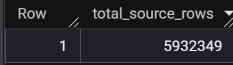
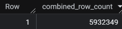

# Cyclistic Bike-Share Analysis: How Do Annual Members and Casual Riders Use Bikes Differently?

## Overview
This project analyzes historical bike-share trip data for Cyclistic, a fictional bike-share company operating in Chicago, as part of the Google Data Analytics Professional Certificate capstone. The goal is to understand behavioral differences between annual members and casual riders in order to support a marketing strategy aimed at converting casual riders into annual members.

## Business Task
Cyclistic's director of marketing believes the company's future growth depends on maximizing annual memberships, since annual members are more profitable than casual riders. Rather than targeting new customers broadly, the marketing team wants to convert existing casual riders into annual members.

This analysis specifically addresses the first of three guiding questions assigned to the marketing analytics team:

> **How do annual members and casual riders use Cyclistic bikes differently?**

## Data Source
This analysis uses Cyclistic's historical trip data, made publicly available by Motivate International Inc. (operators of the real-world Divvy bike-share system, on which this fictional case study is based).

- **Source:** [Divvy Trip Data](https://divvy-tripdata.s3.amazonaws.com/index.html)
- **License:** [Divvy Data License Agreement](https://divvybikes.com/data-license-agreement) — grants a non-exclusive, royalty-free, limited, perpetual license to access, analyze, and use the data for any lawful purpose.
- **Time period covered:** 12 months, July 2025 – June 2026
- **Format:** Monthly `.csv` files, one per month, imported as individual tables into Google BigQuery (dataset: `CyclisticData`, tables `2025-07-Trips` through `2026-06-Trips`)
- **Privacy note:** The dataset does not include personally identifiable rider information, so this analysis cannot connect ride data to individual riders (e.g., whether a casual rider has purchased multiple single-ride passes, or whether they live within the service area).

**Data credibility (ROCCC check):**
- **Reliable:** Sourced directly from the bike-share operator, not a third party
- **Original:** First-party trip-level data, not aggregated or altered by another source
- **Comprehensive:** Covers a full 12-month cycle, capturing seasonal variation
- **Current:** Reflects the most recent 12 months available at the time of analysis
- **Cited:** Publicly documented source and license, linked above

**Tools used:** Google BigQuery (SQL) for data storage, combination, cleaning, and analysis. Tableau for data visualizations.

## Process

### Tools Used
This phase was completed entirely in **Google BigQuery** using SQL, chosen for its ability to handle the full dataset without local file-size limitations and for direct compatibility with the SQL skills this project is meant to demonstrate.

### Correcting a Mislabeled File
While reviewing the twelve monthly files prior to combining them, one file intended to represent January 2026 trip data was found to be mislabeled as `202501-divvy-tripdata`. This was identified by opening the file and confirming that the dates in the spreadsheet fell in the year 2026. The file was renamed to `202601-divvy-tripdata`and its corresponding BigQuery table was renamed to `2026-01-Trips` to accurately reflect the data it contained.

### Combining the Twelve Monthly Tables
Each month of trip data (July 2025 – June 2026) was originally imported into BigQuery as its own table (`2025-07-Trips` through `2026-06-Trips`), all within the `CyclisticData` dataset. Since all twelve tables share an identical schema, they were combined into a single table using a wildcard query rather than twelve individual `UNION ALL` statements.

[View full script: `scripts/combine_tables.sql`](scripts/combine_tables.sql)

```sql
CREATE TABLE `CyclisticData.trips_combined` AS
SELECT *, _TABLE_SUFFIX AS source_table
FROM `CyclisticData.20*`
```

The `_TABLE_SUFFIX` column was included to preserve a record of which original table each row came from, making it possible to trace any row back to its source month if needed during later validation or cleaning.

### Validating the Combine
Next, the combine was verified by comparing the summed row count of all twelve original tables against the row count of the new combined table.

**Query used:**
```sql
-- Total row count of twelve original tables
SELECT SUM(row_count) AS total_source_rows
FROM `CyclisticData.__TABLES__`
WHERE table_id != 'trips_combined';

-- Total row count of combined table
SELECT COUNT(*) AS combined_row_count
FROM `CyclisticData.trips_combined`;
```

**Results:**

Sum of row counts across the twelve original tables:



Row count of the combined table:



The two totals matched, confirming that all rows from the twelve monthly tables were preserved in the combine with no data loss or duplication.
